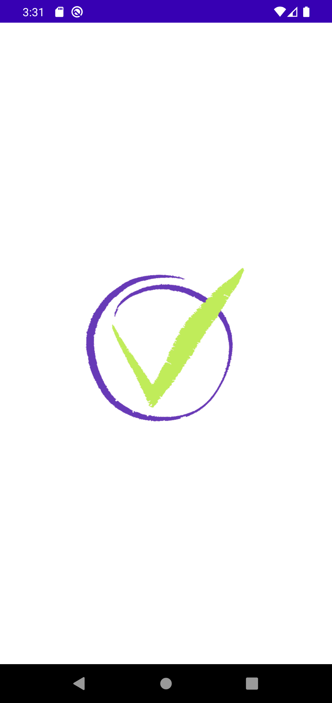
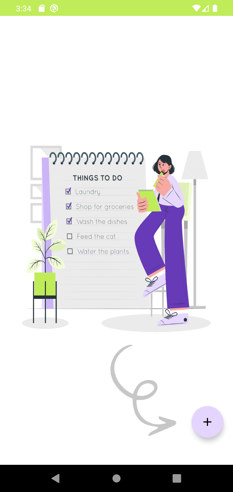
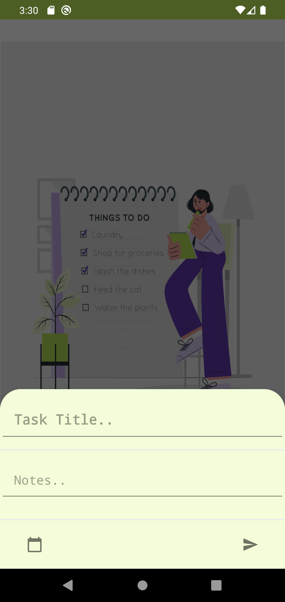
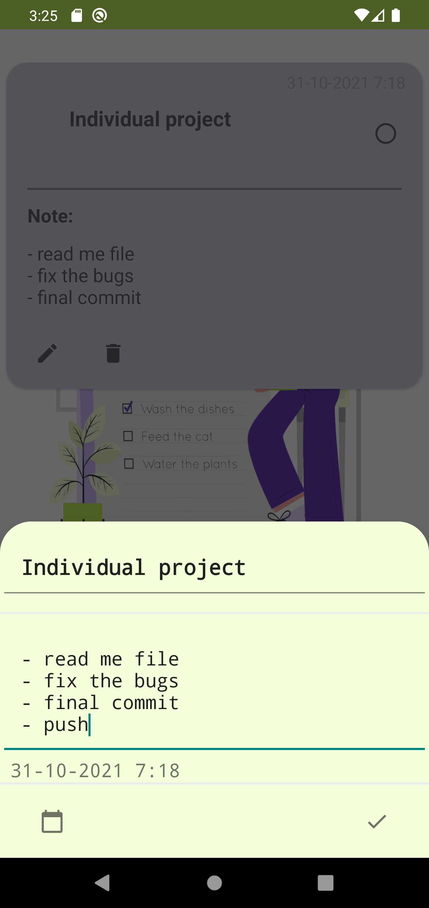
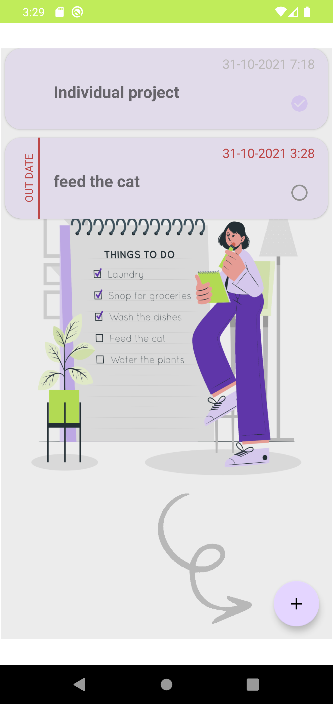

# ToDo-List-App
---

<!--- Replace <OWNER> with your Github Username and <REPOSITORY> with the name of your repository. -->
<!--- You can find both of these in the url bar when you open your repository in github. -->

## Description
---

Simple to do list app , Allow the user to add and edit task by enter title, note, due date of the task and marked the done tasks.
Depending on the due date entered disallow the user to marked task if the task outdated.

## Motivation and Context
---
aditional to MainActivity I used 1 Activity and 3 Fragments:

SplashScreen -> to disply the logo screen when start the app
Fragments: 
- MainFragment -> to show the Tasks list.
- NewTaskFragment -> to enable the user to add task.
- EditTaskFragment -> to enable the user to add task.

Additional features:
- Room.
- Expanded RecyclerView.
- Elastic card View.
- Bottom sheet dialog fragment.

## Screenshots
---
### screenshot_1

### screenshot_2

### screenshot_3

### screenshot_4

### screenshot_5

